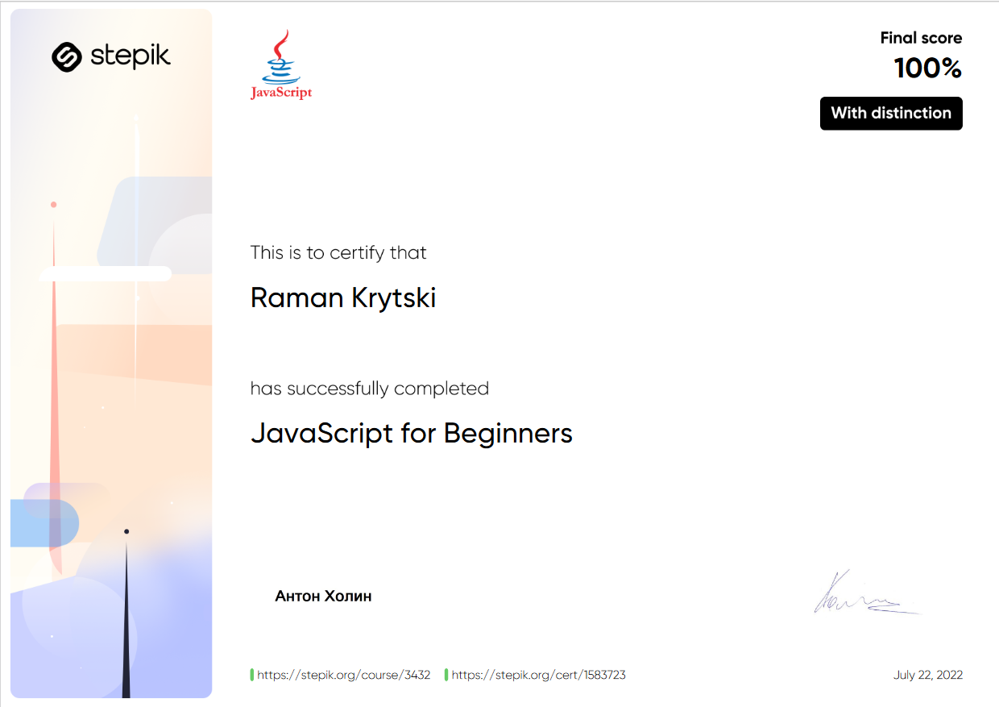
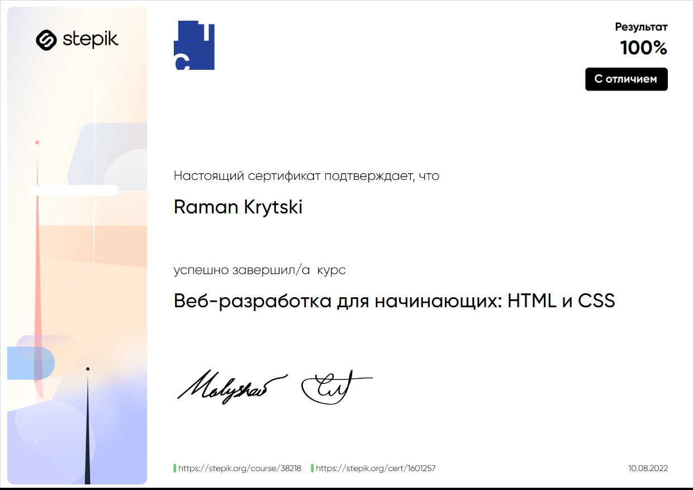

# Raman Krytski


## _contact_

**mail**: rkeydevelop@gmail.com
\
**ph. num**: PL +48 794 673 466 
\
**discord**: RomanKrytski_RKeyIT#5953
\
**github**: https://github.com/RKeyIT
\
**telegram**: @iRKey / +48794673466

## _Bio_

*Hi there!* My name is Roman Krytski. Yes! R **o** man. That's so funny story. Prepare yourself!
\
I was borned Russia. In this country and this language we can meet only "Roman" name. Buuut... If you will re-locate yourself in Belarus and gots Belarus citizenship (or nationality) you will change this name on "rAman" if you didn't nothing with that. Of Course you will not. You know why? Because you didn't know belarus language rules! \:\)
\
Because in belarus language we cant to say Roman with akcent on **a**, because in language rules we have point like this: _If we have letter **o** into word, akcent into word will be on this letter **O**_. Exactly it means that my name (read with akcent on 'a') Roman akcent will changed on letter **o**...

So that was trouble for administration of my country and i've been know about my new name only when got's my pasport.

And now (already in Poland) my name is 'Raman' (with latin letters), before Poland my name was 'Раман'.

**Pleased to meet you \:\)**

## _Skills_

1. JavaScript
2. HTML/CSS Basics
3. Russian/English/Polish languages
4. Friendship and responsibility

### JavaScript
I've been done stepik courses in first RUS in second repeat this course but ENG
\
https://stepik.org/course/2223
\
https://stepik.org/course/3432

_Little story_
\
I'd like learn all about this. OP, prototypes, promises, React framework. I love this language! Due to JavaScript i've been understand that i loved programming! I've been have practice with React Native and some ideas to do cross-platform application that will help peoples better control theys moneys. Before became again to develop this app I want to walk path of programmer and JS will be my friend on this way.

### HTML/CSS
I've been done that stepik course
\
https://stepik.org/course/38218

_Little story_
\
When I was yong I was love to do Internet pages with helpful constructors like ucoz.com
\
But this was is not enouph for me. I wanted to know how it works. And that's I started read. Little time after I wrote my first page by my hands. Yea, that was not really beautifull but that was mine. 
\
Unfortunately that wasn't been long. That was my child tries. But now I got back!

### Russian/English/Polish languages
As you already know - my way was from Russia to Poland.
\
Language skill levels from up to down.

Russian is native

English is pre-Intermediate (may be **\:\)**)
\
English is was my best friend in first time in Poland. Before starts talkin with poland language i was communicate with people only with english.

Polski is communicative

### Friendship and responsibility
I had much jobs and cool experience. 
Where I worked? 
1. McDonnalds
2. Cinema group
3. Electronic store
4. Grocery store
5. Toy warehouse
6. Furniture warehouse
7. Spare parts warehouse

That jobs getted me skils like:
* Сommunication skills - at some jobs I was the organizer of corporate parties
* Responsibility - at some jobs I works with moneys and goods handlings
* Smilingness and friendship - McDonnalds and Cinema Group gots me a lot positive feelings and skills.

## _Code examples_ + *Experience*
### MyHelloWorld
#### _1_
 In my main project you can see much of my code.
 \
 Interesting here is Object model of Coin and custom methods.
 \
 **BUT MY PROJECT WAITS MY LVLup**
 \
 *And this work will need a little cleaned up*
 \
 https://github.com/RKeyIT/MyHelloWorld
 ```
 class Coin {        // Class and after this functions for this class
    constructor(){
        this.date = new Date();
    }
    take(){
        this.amount = Number(document.getElementById('add').value),
        this.comment = document.getElementById('addedFrom').value,
        this.color = 'green';
        MONEYS.push(coin)
    }
    spend(){
        this.amount = Number(document.getElementById("less").value),
        this.comment = document.getElementById('losedFor').value,
        this.color = 'red';
        MONEYS.push(coin)
    }
    save(){
        this.amount = Number(document.getElementById('save').value),
        this.comment = document.getElementById('saveFor').value,
        this.color = 'blue';
        MONEYS.push(coin)
    }
}

//Operative functions with this class
    function takeCoin() {
        if (document.getElementById('add').value <= 0) {return}
        else {
        coin = new Coin()
        coin.take();
        calculateCurrentMoneys();
        spendPerDay();
        document.getElementById('add').value = '';
        document.getElementById('addedFrom').value = '';
        }
    }
    function spendCoin() {
        if (document.getElementById('less').value <= 0) {return}
        else {
        coin = new Coin ()
        coin.spend();
        calculateCurrentMoneys();
        spendPerDay();
        document.getElementById('less').value = '';
        document.getElementById('losedFor').value = '';
        }
    }
    function saveCoin() {
        if (document.getElementById('save').value <= 0) {return}
        else {
        coin = new Coin ()
        coin.save();
        calculateCurrentMoneys();
        spendPerDay();
        document.getElementById('save').value = '';
        document.getElementById('saveFor').value = '';
        }
    }
 ```
### Algorithm practice
#### _2_
That was my first try to "**Selection sort**"
\
https://github.com/RKeyIT/AlgorithmPractice/blob/main/3.SortAlgorithms/2.%20MyTry/script.js
```
let oBig = 0;
sortArr(arr);
function sortArr(arr) {
    if (arr.length <= 1) return arr;
    for (i = 0; i < arr.length; i++) {
        oBig++
        if (arr[i] == arr[i + 1]) {
            continue;
        }
        if (arr[i] > arr[i + 1]) {
            let indx = arr[i + 1];
            arr[i + 1] = arr[i];
            arr[i] = indx;
            i = 0;
        }
        if (arr[i] < arr[i - 1]) {
            let indx = arr[i - 1];
            arr[i - 1] = arr[i];
            arr[i] = indx;
        }
    }
    console.log('oBig = +- O\(n*n\) = ' + oBig)   // 97001
    return arr;
}
```
Interesting here what my algorithm some times gots result less than O(n**2)
\
That's bounded different array fillings

#### _3_
**Convert any number to binary**

```
function convToBinary(num) {
    //   debugger
    // argument
    // next string was used like another debug mod 
    var trueResult = num.toString(2);
    // result array
    var arr = [];
    // doubled variable
    var dbl = 1;

    //if number equals negative
    if (num < 0 || typeof num != "number") {
        return Error("Invalid value");
    }

    // if number equals 0 or 1
    if (num == 0 || num == 1) {
        return "" + num;
    }

    // double dbl variable for search
    // firrst higher value then entered
    while (dbl < num) dbl *= 2;

    // general loop
    while (dbl > 0 && num > 0) {
        if (num === dbl) {
            let degree = 0;
            while (num != 2 ** degree) {
                degree++;
            }
            arr.push("1");
            num -= num;
            dbl -= dbl;
            while (degree >= 1) {
                arr.push("0");
                degree--;
            }
        }

        if (num == 0 && dbl > 0) {
            arr.push("0");
            break;
        }
        if (dbl == 1) {
            arr.push("1");
            --dbl;
            break;
        }
        if (dbl > num) {
            arr.push("0");
            dbl /= 2;
        }
        if (dbl < num) {
            arr.push("1");
            num -= dbl;
            dbl /= 2;
        }
    }
    if (arr[0] == 0) {
        arr.reverse();
        arr.length = arr.length - 1;
        arr.reverse();
    }
    if (trueResult != arr.join("")) {
        return Error("ERROR! Values result did not equals");
    }
    return (arr = arr.join(""));
}

convToBinary(3);
```

## Education

### 1
**JS (Eng)**
#### Course
https://stepik.org/course/3432
##### Certificate
https://stepik.org/cert/1583723


### 2
**HTML/CSS**
#### Course
https://stepik.org/course/38218
##### Certificate
https://stepik.org/cert/1601257
